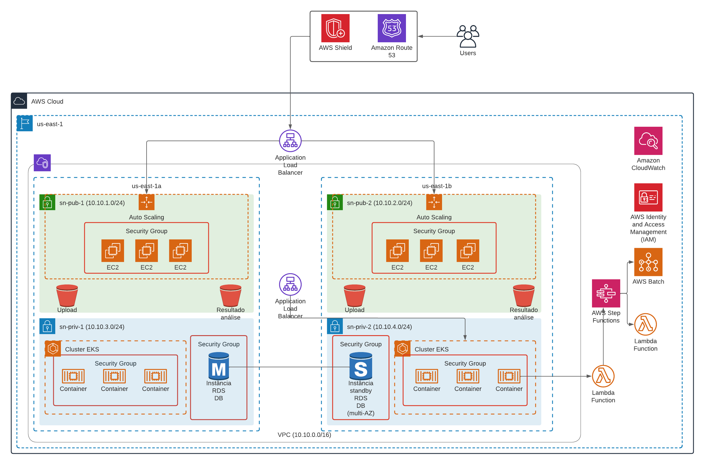

# Desafio Varstation
O objetivo deste repositório será documentar o desafio proposto pela Varstation.

Issue: [Desafio Varstation](https://github.com/Varstation/desafio-devops-varsomics)

## Arquitetura

Seguindo os padrões solicitados na descrição do desafio, realizei o desenho de arquitetura para análise de dados de espectometria no provedor AWS.

## Recursos utilizados na arquitetura

- Route 53: É um serviço de DNS da AWS. Este serviço pode ser utilizado para ajudar no gerenciamento e direcionamento de tráfego de internet para os recursos da AWS. Suporte a registro de domínio, balanceamento de carga, roteamento de DNS (simples, failover, geolocalização, geoproximidade, latência, ponderado)

- Shield: É um serviço de proteção contra ataques DDoS da AWS. Este serviço ajuda a garantir a proteção das aplicações e dos recursos, tendo em vista que ele não irá permitir que sua aplicação saia do ar, e escalonamento dos seus recursos.

- Elastic Load Balancer: É um serviço de balanceamento de carga da AWS. Este serviço é responsável por distribuir o tráfego de rede de maneira equilibrada e sem sobrecarregar as instâncias da qual está registrado em seu target.

- Auto Scaling: É um serviço que permite ajustar automaticamente recursos computacionais de acordo a carga que ele está recebendo. Este serviço garante a elasticidade da sua arquitetura, tendo em vista que ele irá evitar sobrecarga ou desperdício de recursos.

- EC2: É um serviço computacional da AWS que permite você provisionar máquinas virtuais na AWS.

- Security Group: É um recurso de segurança que a AWS oferece. São semelhantes a um firewall, garantindo o controle do tráfego de entrada e saída de alguns recursos da AWS, como as instâncias EC2, RDS, entre outros.

- S3: É um serviço de armazenamento de objetos oferecido pela AWS. Consegue suportar vários tipos de dados, como por exemplo arquivos, vídeos, backups, imagens, logs, entre outros.

- RDS: É um serviço de banco de dados relacional gerenciado pela própria AWS. Oferece suporte a diversos tipos de bancos de dados como por exemplo MySQL, Oracle, Microsoft SQL Server, PostgreSQL, Amazon Aurora. Permite fazer backup e recuperação de dados, além de ter funções de Multi-AZ.

- EKS: É um serviço de orquestração de containers da AWS. Ele faz a implantação, gerenciamento e escalabilidade de aplicações que rodam em containers e utilizam o Kubernetes para orquestração e gerenciamento.

- VPC: É um serviço de redes da AWS que permite você criar uma rede isolada e privada na nuvem. É dentro desta rede que você irá conseguir provisionar seus recursos na AWS.

- CloudWatch: É um serviço de monitoramento da AWS que permite o usuário monitorar, coletar e armazenar métricas dos recursos utilizados na AWS.

- IAM: É um serviço de identidade da AWS, que permite controlar e gerenciar contas, recursos e serviços usados na nuvem da AWS. Neste serviço você tem a possibilidade de criar usuários, grupos, policy, e roles, podendo personalizar as permissões de determinados recursos.

- Step Functions: É um serviço de orquestração de tarefas da AWS. Permite você criar, executar e gerenciar workflows. Permite orquestrar diferentes serviços da AWS para executarem tarefas complexas.

- Lambda: É um serviço de coputação serveless oferecido pela AWS que permite você executar código de forma escalável sem precisar provisionar e gerenciar um servidor. É um serviço totalmente flexível, podendo ser invocado de acordo a necessidade da sua arquitetura.

- Batch: É um serviço de processamento em lote da AWS. Consegue executar facilmente workflows de processamento em lote de alta perfomance na AWS.

- Cost Explorer: É uma ferramenta de análise de custos oferecida pela AWS. Permite que você faça uma análise de todos os gastos que você está tendo na nuvem da AWS.

- CloudFormation: É um serviço de IaC da AWS. Permite que você crie e gerencie a sua infraestrutura como código na AWS, além de ter a possibilidade de versionamenteo da sua infraestrutura.

## Fluxo da arquitetura

1. O usuário irá acessar o site através do DNS que está registrado no Route 53.
2. O Shield irá analisar as solicitações do usuário, caso ele perceba que o site está sofrendo ataque DDoS, ele irá bloquear o IP de origem.
3. O usuário será direcionado através do Load balancer para o front-end Django.
4. Quando o usuário realizar um upload de arquivo através do front-end, será armazenado no bucket S3 'Upload'. Este bucket será configurado com um lifecycle de 1 ano.
5. Caso o usuário faça uma solicitação de análise de espectrometria de massa, ele irá fazer uma chamada na FastAPI que está no cluster Kubernetes. Para não sobrecarregar o cluster foi colocado um ALB, que irá rotear o tráfego para os pods do cluster Kubernetes.
6. Quando a API receber a solicitação ela irá invocar uma chamada Lambda que irá acionar o Step Functions para o processamento dos dados.
7. O Step Functions consegue coordenar várias etapas, como o pré-processamento, a análise, e o pós-processamento. Sendo assim, ele poderá invocar uma função lambda ou realizar o processamento no AWS Batch, isso irá depender da necessidade da tarefa.
8. Caso ele acione o Batch, este irá realizar o provisionamento dos recursos necessários para o processamento dos dados.
9. Os dados gerados serão armazenados no bucket S3 'Resultado Análise', para caso o usuário queira consultar os resultados da sua consulta. Este bucket será configurado com um lifecycle de 5 anos para consultas.
10. Informações como análise, informações do usuário, status de execução, entre outros dados, serão armazenados no RDS Multi-AZ para garantir maior disponibilidade dos dados.

## Observações

- Os recursos computacionais e o bando de dados serão protegidos por grupos de segurança, para controlar o fluxo de entrada nos serviços.
- Toda a infraestrutura poderá ser monitorada pelo CloudWatch, realizando a coleta de desempenho e saúde dos recursos.
- A infraestrutura foi projetada para ter alta disponibilidade e garantir o backup dos dados.
- Através do AWS Cost Explorer poderá ter insights de custos e realizar o monitoramento de gastos.
- Seguindo as boas práticas DevOps, deverá ser utilizado ferramentas como AWS CloudFormation e/ou Terraform para o provisionamento da arquitetura proposta em IaC, e utilização de pipelines CI/CD.
